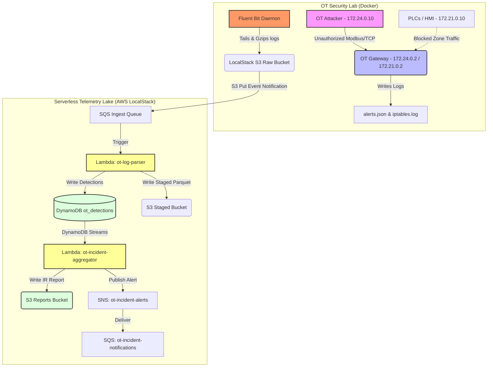

# Cloud Telemetry Lake

[](https://www.terraform.io/)
[](https://localstack.cloud/)
[](https://fluentbit.io/)
[](https://aws.amazon.com/lambda/)

An end-to-end industrial cybersecurity telemetry pipeline that ingests, parses, analyzes, and archives security event logs generated from a simulated Operational Technology (OT) network segmented according to the **Purdue Reference Model**.

The system collects raw network traffic drops and Intrusion Detection System (IDS) alerts from the OT Gateway, processes them serverlessly in real time, writes stateful detection records to DynamoDB, generates structured Incident Response reports, and stages long-term analytical data in columnar Parquet format.

---

## Architecture



---

## Core Features

*   **Purdue Model Network Simulation:** Multi-zone Docker environment covering Level 4/5 (IT/Attacker), Level 3 (Operations Gateway), and Level 1/2 (Control Zone with Modbus PLCs).
*   **Custom IDS Rule Engine:** Gateway runs Scapy-based Python listeners detecting:
    *   `CROSS_ZONE_VIOLATION` (MITRE T0886): Direct communication attempts bypassing Level 3 boundary rules.
    *   `UNAUTHORIZED_MODBUS_WRITE` (MITRE T0831): Unauthorized Modbus register writes from untrusted sources.
    *   `OT_BRUTE_FORCE_SCAN` (MITRE T0846): Excessive Modbus exceptions indicating scanner or brute-force activity.
*   **Firewall Log Capture:** Mock packet sniffer emulates kernel iptables drop entries for cross-zone policy blocks.
*   **Structured Log Shipping:** Fluent Bit collects, compresses, and ships log streams to S3 with Hive-partitioned keys (`source=`, `date=`).
*   **Serverless Ingestion Pipeline:** S3 events → SQS → Lambda parses and routes logs with dynamic gzip detection.
*   **Stateful Security Correlation:** Detection records written to DynamoDB with GSIs for severity and host-based querying.
*   **Automated Incident Response:** DynamoDB Streams trigger the aggregator Lambda to produce NIST SP 800-61 IR reports and publish SOC alerts via SNS.
*   **Analytical Storage:** Parsed logs staged as snappy-compressed Apache Parquet, partitioned by source and date.

---

## LocalStack & Engineering Workarounds

This project is deployed against **LocalStack Community Edition** as a local AWS emulation environment. Three platform constraints required explicit engineering solutions:

1.  **Fat-Zip Dependency Packaging:** LocalStack Community does not mount Lambda Layers to `/opt` at runtime. Dependencies (`pandas`, `awswrangler`, etc.) are bundled directly inside the deployment archive under `python/` and injected into `sys.path` at cold-start time.
2.  **S3-Based Lambda Deployment:** The fat-zip archive exceeds the 50 MB AWS direct API upload limit. Terraform stages the zip to S3 first (`aws_s3_object`) and provisions the function by S3 reference (`s3_bucket` / `s3_key`).
3.  **Dynamic Gzip Detection:** Fluent Bit uploads gzip-compressed payloads with a `.json` key extension. The Lambda handler inspects the first two magic bytes (`\x1f\x8b`) at runtime and renames the file with a `.gz` suffix before passing it to the parser, enabling transparent decompression.

---

## Getting Started

### 1. Prerequisites

*   [Docker](https://www.docker.com/) and Docker Compose V2
*   [Terraform](https://www.terraform.io/) >= 1.0
*   [AWS CLI](https://aws.amazon.com/cli/)

### 2. Deploy Infrastructure

```bash
# Start LocalStack Community
docker run -d --name localstack -p 4566:4566 localstack/localstack

# Deploy all AWS resources via Terraform
cd terraform
terraform init
terraform apply -auto-approve
```

### 3. Start the OT Security Lab

```bash
cd ../ot-security-lab/lab-environment
docker compose up -d

# Apply zone firewall rules to the gateway
docker cp network-config/firewall-rules.sh ot_gateway:/firewall-rules.sh
docker exec ot_gateway chmod +x /firewall-rules.sh
docker exec ot_gateway /firewall-rules.sh
```

### 4. Start Gateway Detection Daemons

```bash
docker exec -d ot_gateway python3 /scripts/sniffer.py
docker exec -d ot_gateway python3 /detection/rules/cross_zone_traffic.py
docker exec -d ot_gateway python3 /detection/rules/modbus_anomaly.py
docker exec -d ot_gateway python3 /detection/rules/ot_brute_force.py
docker exec -d ot_gateway python3 /detection/rules/process_safety_violation.py
```

### 5. Run the Attack Simulation

```bash
docker exec -it ot_attacker python3 /attacker/simulate_attack.py
```

### 6. Upload Malcolm NDR Fixture Alerts (Optional)

Uploads a batch of Suricata EVE-format alerts simulating a Malcolm NDR sensor feed:

```bash
python3 src/malcolm_fixture/upload_malcolm_alerts.py --endpoint-url http://localhost:4566
```

---

## Verification

Once the simulation completes, Fluent Bit ships logs to S3, the parser Lambda processes them, and the aggregator Lambda generates an IR report. All steps can be verified via the AWS CLI against LocalStack.

### 1. DynamoDB — Detection Records

```bash
AWS_ACCESS_KEY_ID=mock AWS_SECRET_ACCESS_KEY=mock AWS_DEFAULT_REGION=us-east-1 \
aws --endpoint-url=http://localhost:4566 dynamodb scan --table-name ot_detections
```

Expected `incident_correlator` values: `CROSS_ZONE_VIOLATION#ot_sensor`, `UNAUTHORIZED_MODBUS_WRITE#ot_sensor`, `OT_BRUTE_FORCE_SCAN#ot_sensor`.

### 2. S3 Staged Bucket — Partitioned Parquet

```bash
AWS_ACCESS_KEY_ID=mock AWS_SECRET_ACCESS_KEY=mock AWS_DEFAULT_REGION=us-east-1 \
aws --endpoint-url=http://localhost:4566 s3 ls s3://ot-telemetry-staged-000000000000 --recursive
```

Expected partitions: `parsed/date=<DATE>/source=iptables/`, `source=ot_sensor/`, `source=malcolm/`.

### 3. S3 Reports Bucket — NIST IR Reports

```bash
AWS_ACCESS_KEY_ID=mock AWS_SECRET_ACCESS_KEY=mock AWS_DEFAULT_REGION=us-east-1 \
aws --endpoint-url=http://localhost:4566 s3 ls s3://ot-telemetry-reports-000000000000 --recursive
```

Expected: `incidents/<uuid>.json` — one report per detection batch, containing `incident_id`, `severity`, `mitre_techniques`, `affected_assets`, `timeline`, and `recommended_actions`.

### 4. SNS Notification Delivery

```bash
AWS_ACCESS_KEY_ID=mock AWS_SECRET_ACCESS_KEY=mock AWS_DEFAULT_REGION=us-east-1 \
aws --endpoint-url=http://localhost:4566 sqs receive-message \
  --queue-url http://sqs.us-east-1.localhost.localstack.cloud:4566/000000000000/ot-incident-notifications \
  --max-number-of-messages 3
```

Expected subject format: `[<SEVERITY>] OT Incident <ID> – <N> Detection(s) | Techniques: T0831, T0846, T0886`.